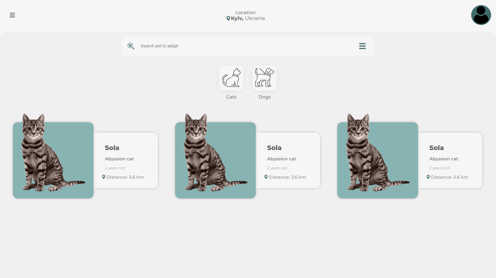
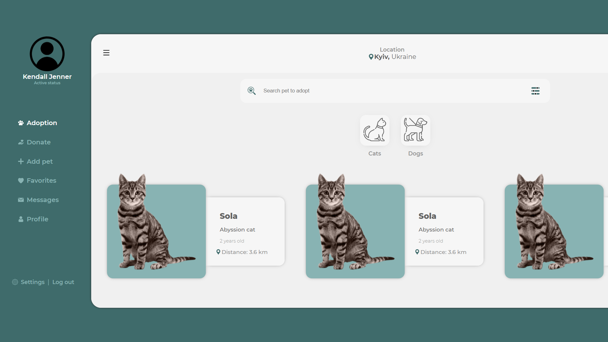

# LAYOUT ADOCAO PETS
Layout em desenvolvimento para serviço de adoção de animais abandonados de rua, com a ideia de alcançar uma gama maior de pessoas assim dando um lar para esses animais abandonados.

# FASES DO PROJETO

## FASE 1
 - [x] Criacao e composicao do layout
    - [] Implementacao de responsividade para todas as plataformas

## FASE 2
 - [] Reestruturacao do projeto para MVC
 - [] Implementacao de Banco de Dados MySQL e PHP

## OBJETIVO DO PROJETO
A ideia com esse projeto e fornecer um sistema gratuito para pessoas que dedicam seu tempo a cuidarem e tratarem de animais abandonados, a poderem divulgar seus trabalhos pela internet por meio de um site que ira contar com a base de dados dos animais cadastrados dessa forma facilitado sua adocao. 